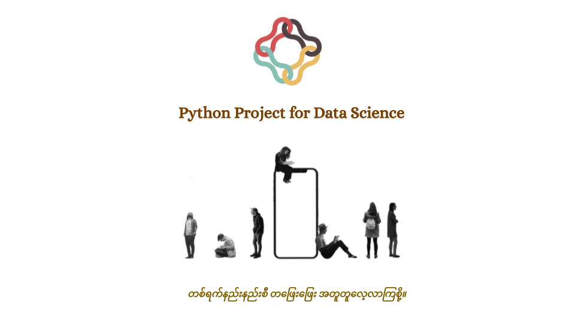

This is code repo for sample examples codes.



## Installation for required libraries 
1. Install Chrome Driver and Selenium and required library - Ubuntu 

    ```bash
    $ sudo bash chrome_driver_selenium.sh
    $ pip install -r requirements.txt
    ```